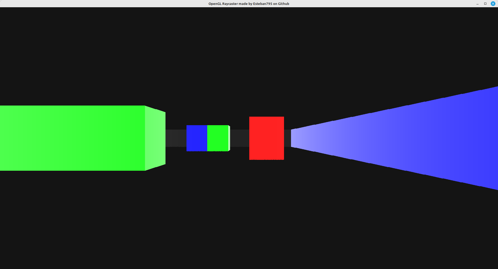

# opengl-raycaster
## A non RAM-eating raycaster made with C and OpenGL 3.0.


### __Warning__

- You might encounter memory leaks when the program closes. It depends, as it seems, whether you use a Nvidia graphics card with SDL2. I'm not entirely sure what is causing them behind the scenes, but I can't seem to fix it. There are **zero** (at least I hope) memory leaks that are caused by myself in this program. Here is a [link](https://forums.developer.nvidia.com/t/asan-reports-memory-leak-in-libnvidia-glcore-so-515-57/222697/2) that could explain you the situation. It sucks, but I can't really do anything about it on my own. I don't own nvidia.glibcore..
<br />

*P.S : you might not see those memory leaks warnings,because I run `clear` right after the program ends.*


### __What does it do ?__
- As you might have guessed it, it showcases an example of a raycaster, using a naive algorithm of raymarching, which causes some interesting problem once in a while. Definitely something to work on ! Basically, it casts rays in the direction that you're looking, and displays the result on your screen.
<br />
<br />

### __Requirements__
- Obviously, a C compiler. I tested the raycaster with both gcc (version 11.3) and clang, but really any decent C compiler should be ok running this.
- Both SDL2, glew,glut, and OpenGL (I used version 3.0) are necessary to make the program work. You can install them on your own computer using the makefile by typing 
```ps
make install
```
after you're done cloning the repo on your computer, using : 
```ps
git clone https://github.com/Esteban795/opengl-raycaster.git
```
or whatever you want.
<br/>
If for some reasons, ```make install``` doesn't work, you can install them manually using 
```ps 
apt install libglew-dev libsdl2-dev freeglut3-dev
```

<br/>

### __How to install it on your computer ?__

- Just clone it wherever you want in your computer.

```ps
git clone https://github.com/Esteban795/opengl-raycaster.git
```
- From there, you can just run 
```ps
make all
```
It should render this : 
<br/>




## How to use it ?

- I'm french. So these are the standards french keyboards layouts at use. There is currently no plan to add keyboard layout detection.

| Keys        | What they do                  |
|-------------|-------------------------------|
| z  | go forwards        |     |
| s| go backwards          |
| q | go left| 
| d  | go right  |
| RIGHT_ARROW | turns camera to the right |
| LEFT_ARROW         | turns camera to the left              |


<br />
<br />

### __What's left to do__ ?
 
- Maybe add some kind of lighing ?
- Textures onto walls ? Right now, it can only display a few colors, but it isn't posssible to display more than a single color per wall. It forces pretty bland designs.
- Just found out about this [tutorial](https://lodev.org/cgtutor/raycasting.html) with a different algorithm. I might reimplement the ray casting stuff !
- Allow users to input their own map ! (work in progress, see ```read_world``` function in src/map.c).
- A minimap in one of the two top corners. I need to figure out how to draw this and update our player position.